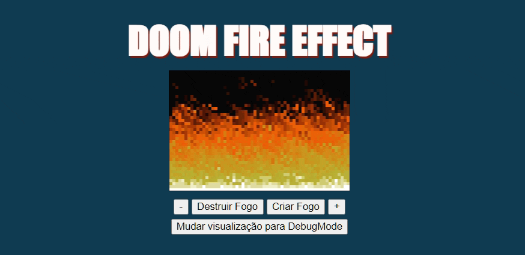

# DoomFire

Este projeto foi criado com intuito de aprimorar e aprender sobre a construção de páginas web, usando o JavaScript para realizar toda a lógica de exibiçãodo no HTML.

Essa implementação foi baseada no projeto do [Filipe Deschamps](https://www.youtube.com/watch?v=fxm8cadCqbs&t=1s).

Uma melhoria realizada, foi a adição do backend utilizando Flask com python. Foi uma ótima forma entender como integrar backend e frontend, mesmo utilizando linguagens de programação diferentes.

